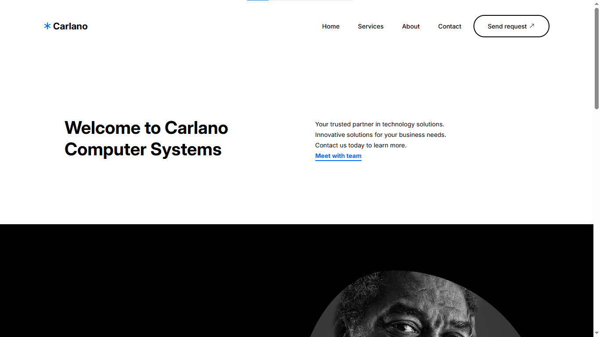

# Carlano Computer Systems

### Hi everyone..👋..

This project was done as an assignment for my part 2.1 Web Development module at Harare Institute of Technology. The project is a company website which lists the services and products it provides. The project was done in groups of 5. The people I worked with, **[John Diya](https://github.com/xoan0/)**, **[Takunda Chigwedere](https://github.com/e-i-p/)**, **[Byron Matsikembare](https://github.com/matsikembareb/)** and **[Victoria Mahuni](https://github.com/botvicky/)**, helped me in designing this website. 

## How to run project

To run the project, simply open the `index.html` file in a browser and yeah, that's it. Simple right? 